<div align="center">

# 🤖 CES Test Suite Agent

### Comprehensive Testing Platform for Google Dialogflow CX Agents

[](https://nodejs.org/)
[](https://reactjs.org/)
[](https://www.typescriptlang.org/)
[](https://cloud.google.com/dialogflow)
[](LICENSE)

<p align="center">
  <strong>Enterprise-grade testing solution for validating conversational AI agents with real-time analytics, bulk testing, and comprehensive coverage reports.</strong>
</p>
</div>

## ✨ Features

### 🎯 Single Conversation Testing
- Real-time conversation simulation
- Intent detection & confidence scores
- Parameter extraction validation
- Page flow verification


### 📦 Bulk Testing Suite
- CSV file upload support
- Concurrent test execution
- Progress tracking & reporting
- Batch result analysis


### 📊 Analytics Dashboard
- Pass/fail rate metrics
- Trend analysis over time
- Coverage statistics
- Recent run summaries


### 🎭 Conversation Simulator
- Interactive chat interface
- Multi-turn conversation support
- Session state management
- Response comparison tools


### 📈 Coverage Reports
- Intent coverage tracking
- Page coverage analysis
- Untested flow identification
- Gap analysis reports


### ⚙️ Multi-Agent Support
- Multiple agent configurations
- Environment switching
- Centralized settings management
- Secure credential storage


## 🚀 Quick Start

### Prerequisites

| Requirement | Version | Description |
|------------|---------|-------------|
| Node.js | 18+ | JavaScript runtime |
| npm/yarn | Latest | Package manager |
| Redis | 6+ | Queue management (optional) |
| Google Cloud | - | Project with Dialogflow CX API enabled |

### Installation

```bash
# Clone the repository
git clone https://github.com/Yash-Kavaiya/CESTestSuiteAgent.git
cd CESTestSuiteAgent

# Install frontend dependencies
cd frontend && npm install

# Install backend dependencies
cd ../backend && npm install
```

### Environment Setup

```bash
# Create environment file
cp .env.example .env
```

Configure your `.env` file:

```env
# Server Configuration
PORT=3001
NODE_ENV=development

# Google Cloud Configuration
GOOGLE_CLOUD_PROJECT_ID=your-project-id
GOOGLE_APPLICATION_CREDENTIALS=./path-to-credentials.json
DIALOGFLOW_LOCATION=global
DIALOGFLOW_AGENT_ID=your-agent-id

# Redis Configuration (Optional)
REDIS_HOST=localhost
REDIS_PORT=6379

# Database
DATABASE_URL=./data/database.sqlite

# Frontend URL
FRONTEND_URL=http://localhost:5173

# Test Execution
MAX_CONCURRENCY=5
TEST_TIMEOUT_MS=30000
RETRY_ATTEMPTS=2
```

### Running the Application

```bash
# Terminal 1 - Start Backend Server
cd backend && npm run dev

# Terminal 2 - Start Frontend Development Server
cd frontend && npm run dev
```

🌐 Open your browser and navigate to `http://localhost:5173`

---

## 🏗️ Architecture

### System Overview

```mermaid
flowchart TB
    subgraph Client["🖥️ Client Layer"]
        Browser["Web Browser"]
        UI["React Frontend<br/>Port: 5173"]
    end

    subgraph Server["⚙️ Server Layer"]
        API["Express.js API<br/>Port: 3001"]
        Queue["Bull Queue<br/>(Redis)"]
        DB[(SQLite Database)]
    end

    subgraph External["☁️ External Services"]
        GCP["Google Cloud Platform"]
        DFCX["Dialogflow CX API"]
    end

    Browser --> UI
    UI <-->|REST API| API
    API <--> Queue
    API <--> DB
    API <-->|gRPC| DFCX
    DFCX --> GCP

    style Client fill:#e1f5fe,stroke:#01579b
    style Server fill:#f3e5f5,stroke:#4a148c
    style External fill:#fff3e0,stroke:#e65100
```



### Request Flow

```mermaid
sequenceDiagram
    autonumber
    participant User as 👤 User
    participant Frontend as 🖥️ React Frontend
    participant Backend as ⚙️ Express Backend
    participant DB as 🗄️ SQLite
    participant DFCX as 🤖 Dialogflow CX

    User->>Frontend: Submit Test Case
    Frontend->>Backend: POST /api/v1/simulator/detect-intent
    Backend->>DFCX: detectIntent() gRPC call
    DFCX-->>Backend: Intent Response
    Backend->>DB: Store Result
    Backend-->>Frontend: JSON Response
    Frontend-->>User: Display Results
```



### Bulk Testing Flow


### Component Architecture

```mermaid
graph TB
    subgraph Frontend["Frontend (React + TypeScript)"]
        direction TB
        App["App.tsx"]
        
        subgraph Pages["📄 Pages"]
            Dashboard["Dashboard"]
            BulkTest["Bulk Test"]
            Simulator["Simulator"]
            Results["Results"]
            Coverage["Coverage"]
            Settings["Settings"]
            History["History"]
        end
        
        subgraph Components["🧩 Components"]
            UI["UI Components"]
            Charts["Chart Components"]
            Layout["Layout Components"]
        end
        
        subgraph State["📦 State Management"]
            AgentStore["Agent Store"]
            ResultStore["Result Store"]
            TestStore["Test Store"]
        end
        
        App --> Pages
        Pages --> Components
        Pages --> State
    end

    subgraph Backend["Backend (Node.js + Express)"]
        direction TB
        Server["server.ts"]
        
        subgraph Routes["🛣️ Routes"]
            R1["agents"]
            R2["testCases"]
            R3["runs"]
            R4["results"]
            R5["simulator"]
            R6["simulation"]
            R7["settings"]
        end
        
        subgraph Services["🔧 Services"]
            DFService["DialogflowService"]
            SimService["SimulationService"]
            ConvService["ConversationTestService"]
        end
        
        Server --> Routes
        Routes --> Services
    end

    Frontend <-->|HTTP/REST| Backend

    style Frontend fill:#e3f2fd,stroke:#1976d2
    style Backend fill:#fce4ec,stroke:#c2185b
```



### Data Flow Architecture

```mermaid
flowchart TD
    subgraph UserInterface["🎨 User Interface"]
        Dashboard["📊 Dashboard"]
        Simulator["🎭 Simulator"]
        BulkTest["📦 Bulk Test"]
        Coverage["📈 Coverage"]
    end

    subgraph StateLayer["🗃️ State Management (Zustand)"]
        AgentStore["useAgentStore"]
        ResultStore["useResultStore"]
        TestStore["useTestStore"]
    end

    subgraph APILayer["🔌 API Layer"]
        AgentsAPI["agents.ts"]
        RunsAPI["runs.ts"]
        TestCasesAPI["testCases.ts"]
        AnalyticsAPI["analytics.ts"]
    end

    subgraph BackendRoutes["🛣️ Backend Routes"]
        AgentRoutes["/api/v1/agents"]
        RunRoutes["/api/v1/runs"]
        SimulatorRoutes["/api/v1/simulator"]
        AnalyticsRoutes["/api/v1/analytics"]
    end

    subgraph Services["⚙️ Services"]
        DialogflowSvc["DialogflowService"]
        SimulationSvc["SimulationService"]
        ConversationSvc["ConversationTestService"]
    end

    subgraph ExternalAPIs["☁️ External"]
        DFCX["Dialogflow CX API"]
    end

    Dashboard & Simulator & BulkTest & Coverage --> StateLayer
    StateLayer --> APILayer
    APILayer --> BackendRoutes
    BackendRoutes --> Services
    Services --> DFCX

    style UserInterface fill:#e8f5e9,stroke:#4caf50
    style StateLayer fill:#fff3e0,stroke:#ff9800
    style APILayer fill:#e3f2fd,stroke:#2196f3
    style BackendRoutes fill:#fce4ec,stroke:#e91e63
    style Services fill:#f3e5f5,stroke:#9c27b0
    style ExternalAPIs fill:#e0f7fa,stroke:#00bcd4
```



---

## 📁 Project Structure

```
CESTestSuiteAgent/
│
├── 📂 frontend/                    # React Frontend Application
│   ├── 📂 public/                  # Static assets
│   ├── 📂 src/
│   │   ├── 📂 api/                 # API client modules
│   │   │   ├── agents.ts           # Agent management API
│   │   │   ├── analytics.ts        # Analytics endpoints
│   │   │   ├── client.ts           # Axios client config
│   │   │   ├── conversations.ts    # Conversation history API
│   │   │   ├── runs.ts             # Test runs API
│   │   │   └── testCases.ts        # Test cases API
│   │   │
│   │   ├── 📂 components/
│   │   │   ├── 📂 charts/          # Data visualization
│   │   │   │   ├── BarChart.tsx
│   │   │   │   ├── DonutChart.tsx
│   │   │   │   └── LineChart.tsx
│   │   │   ├── 📂 layout/          # Page structure
│   │   │   │   ├── Header.tsx
│   │   │   │   ├── Layout.tsx
│   │   │   │   └── Sidebar.tsx
│   │   │   └── 📂 ui/              # Reusable UI components
│   │   │       ├── Button.tsx
│   │   │       ├── Card.tsx
│   │   │       ├── FileUpload.tsx
│   │   │       ├── Modal.tsx
│   │   │       ├── ProgressBar.tsx
│   │   │       └── Table.tsx
│   │   │
│   │   ├── 📂 pages/               # Route pages
│   │   │   ├── BulkTest.tsx        # Bulk testing interface
│   │   │   ├── Coverage.tsx        # Coverage reports
│   │   │   ├── Dashboard.tsx       # Main dashboard
│   │   │   ├── History.tsx         # Test history
│   │   │   ├── Results.tsx         # Test results
│   │   │   ├── Settings.tsx        # Configuration
│   │   │   └── Simulator.tsx       # Chat simulator
│   │   │
│   │   ├── 📂 store/               # Zustand state management
│   │   │   ├── useAgentStore.ts
│   │   │   ├── useResultStore.ts
│   │   │   └── useTestStore.ts
│   │   │
│   │   ├── 📂 types/               # TypeScript definitions
│   │   │   └── index.ts
│   │   │
│   │   ├── App.tsx                 # Root component
│   │   ├── main.tsx                # Entry point
│   │   └── index.css               # Global styles
│   │
│   ├── package.json
│   ├── tailwind.config.js
│   ├── tsconfig.json
│   └── vite.config.ts
│
├── 📂 backend/                     # Express Backend Server
│   ├── 📂 data/                    # SQLite database files
│   ├── 📂 uploads/                 # CSV upload storage
│   ├── 📂 src/
│   │   ├── 📂 routes/              # API route handlers
│   │   │   ├── agents.ts           # /api/v1/agents
│   │   │   ├── conversationHistory.ts
│   │   │   ├── results.ts          # /api/v1/results
│   │   │   ├── runs.ts             # /api/v1/runs
│   │   │   ├── settings.ts         # /api/v1/settings
│   │   │   ├── simulation.ts       # /api/v1/simulation
│   │   │   ├── simulator.ts        # /api/v1/simulator
│   │   │   └── testCases.ts        # /api/v1/test-cases
│   │   │
│   │   ├── 📂 services/            # Business logic
│   │   │   ├── conversationTestService.ts
│   │   │   ├── dialogflowService.ts  # Dialogflow CX integration
│   │   │   └── simulationService.ts  # Bulk test processing
│   │   │
│   │   ├── 📂 utils/               # Utility functions
│   │   │   └── comparison.ts       # Result comparison logic
│   │   │
│   │   ├── config.ts               # Environment configuration
│   │   ├── database.ts             # SQLite setup
│   │   └── server.ts               # Express server entry
│   │
│   ├── package.json
│   └── tsconfig.json
│
├── 📄 sample_tests.csv             # Sample test data
├── 📄 sample_simulation.csv        # Sample simulation data
├── 📄 seed.json                    # Database seed data
└── 📄 README.md                    # This file
```

---

## ⚙️ Configuration

### Environment Variables

| Variable | Required | Default | Description |
|----------|----------|---------|-------------|
| `PORT` | No | `3001` | Backend server port |
| `NODE_ENV` | No | `development` | Environment mode |
| `GOOGLE_CLOUD_PROJECT_ID` | **Yes** | - | GCP Project ID |
| `GOOGLE_APPLICATION_CREDENTIALS` | **Yes** | - | Path to service account JSON |
| `DIALOGFLOW_LOCATION` | No | `global` | Dialogflow CX region |
| `DIALOGFLOW_AGENT_ID` | **Yes** | - | Dialogflow CX Agent ID |
| `REDIS_HOST` | No | `localhost` | Redis server host |
| `REDIS_PORT` | No | `6379` | Redis server port |
| `DATABASE_URL` | No | `./data/database.sqlite` | SQLite database path |
| `MAX_CONCURRENCY` | No | `5` | Parallel test execution limit |
| `TEST_TIMEOUT_MS` | No | `30000` | Test timeout in milliseconds |
| `RETRY_ATTEMPTS` | No | `2` | Failed test retry count |

---

## 📡 API Reference

### Base URL
```
http://localhost:3001/api/v1
```

### Endpoints Overview

```mermaid
graph LR
    subgraph API["🔌 REST API Endpoints"]
        direction TB
        
        subgraph Agents["👥 Agents"]
            A1["GET /agents"]
            A2["POST /agents"]
            A3["GET /agents/:id"]
            A4["PUT /agents/:id"]
            A5["DELETE /agents/:id"]
        end
        
        subgraph TestCases["📝 Test Cases"]
            T1["GET /test-cases"]
            T2["POST /test-cases"]
            T3["POST /test-cases/upload"]
        end
        
        subgraph Runs["🏃 Runs"]
            R1["GET /runs"]
            R2["POST /runs"]
            R3["GET /runs/:id"]
            R4["GET /runs/:id/status"]
        end
        
        subgraph Simulator["🎮 Simulator"]
            S1["POST /simulator/detect-intent"]
            S2["POST /simulator/session"]
        end
        
        subgraph Analytics["📊 Analytics"]
            AN1["GET /analytics/dashboard"]
            AN2["GET /analytics/coverage"]
        end
    end

    style API fill:#f5f5f5,stroke:#333
```



### Detailed Endpoint Documentation

#### 👥 Agents

| Method | Endpoint | Description |
|--------|----------|-------------|
| `GET` | `/agents` | List all configured agents |
| `POST` | `/agents` | Create a new agent configuration |
| `GET` | `/agents/:id` | Get agent by ID |
| `PUT` | `/agents/:id` | Update agent configuration |
| `DELETE` | `/agents/:id` | Delete an agent |

#### 📝 Test Cases

| Method | Endpoint | Description |
|--------|----------|-------------|
| `GET` | `/test-cases` | List all test cases |
| `POST` | `/test-cases` | Create a new test case |
| `POST` | `/test-cases/upload` | Bulk upload test cases via CSV |

#### 🏃 Test Runs

| Method | Endpoint | Description |
|--------|----------|-------------|
| `GET` | `/runs` | List all test runs |
| `POST` | `/runs` | Create and start a new test run |
| `GET` | `/runs/:id` | Get run details with results |
| `GET` | `/runs/:id/status` | Get run status and progress |

#### 🎮 Simulator

| Method | Endpoint | Description |
|--------|----------|-------------|
| `POST` | `/simulator/detect-intent` | Send a message and get intent response |
| `POST` | `/simulator/session` | Create a new conversation session |

#### 📊 Analytics

| Method | Endpoint | Description |
|--------|----------|-------------|
| `GET` | `/analytics/dashboard` | Get dashboard metrics and statistics |
| `GET` | `/analytics/coverage` | Get intent and page coverage data |

### Example Requests

#### Detect Intent
```bash
POST /api/v1/simulator/detect-intent
Content-Type: application/json

{
  "projectId": "your-project-id",
  "location": "global",
  "agentId": "your-agent-id",
  "sessionId": "unique-session-id",
  "text": "I want to book a flight",
  "languageCode": "en"
}
```

**Response:**
```json
{
  "success": true,
  "data": {
    "responseText": "Sure! Where would you like to fly?",
    "matchedIntent": "projects/.../intents/flight-booking",
    "intentDisplayName": "flight.booking",
    "confidence": 0.95,
    "parameters": {},
    "currentPage": "Booking Flow"
  }
}
```

#### Upload Test Cases (CSV)
```bash
POST /api/v1/simulation/upload
Content-Type: multipart/form-data

file: test_cases.csv
```

---

## 🧪 Testing Workflows

### CSV Test Format

```csv
conversation_id,turn_number,user_input,expected_intent,expected_response
conv_001,1,"Hello","greeting.welcome","Hi! How can I help you today?"
conv_001,2,"I want to book a flight","flight.booking","Sure! Where would you like to fly?"
conv_002,1,"What's the weather?","weather.inquiry","Please specify a location."
```

### Test Execution State Machine


### Conversation Test Flow

```mermaid
flowchart TD
    Start([Start Test]) --> LoadConv[Load Conversation]
    LoadConv --> InitSession[Initialize Session]
    InitSession --> Loop{More Turns?}
    
    Loop -->|Yes| SendMsg[Send User Message]
    SendMsg --> GetResponse[Get Agent Response]
    GetResponse --> Compare{Compare Response}
    
    Compare -->|Match| Pass[✅ Pass]
    Compare -->|Mismatch| Fail[❌ Fail]
    
    Pass --> NextTurn[Next Turn]
    Fail --> NextTurn
    NextTurn --> Loop
    
    Loop -->|No| SaveResults[Save Results]
    SaveResults --> End([End Test])

    style Pass fill:#c8e6c9,stroke:#4caf50
    style Fail fill:#ffcdd2,stroke:#f44336
```



---

## 🛠️ Tech Stack

### Frontend Technologies

| Technology | Version | Purpose |
|------------|---------|---------|
| ⚛️ React | 18.2 | UI Framework |
| 📘 TypeScript | 5.3 | Type Safety |
| ⚡ Vite | 5.0 | Build Tool & Dev Server |
| 🎨 TailwindCSS | 3.3 | Utility-first CSS |
| 📊 Recharts | 2.10 | Data Visualization |
| 🗃️ Zustand | 4.4 | State Management |
| 🔗 React Router | 6.21 | Client-side Routing |
| 📁 PapaParse | 5.4 | CSV Parsing |
| 🎯 Lucide React | 0.294 | Icon Library |

### Backend Technologies

| Technology | Version | Purpose |
|------------|---------|---------|
| 🟢 Node.js | 18+ | JavaScript Runtime |
| 🚂 Express.js | 4.18 | Web Framework |
| 📘 TypeScript | 5.3 | Type Safety |
| 🗄️ SQLite | - | Database (via better-sqlite3) |
| 🔄 Bull | 4.12 | Job Queue (Redis-based) |
| ☁️ @google-cloud/dialogflow-cx | 4.10 | Dialogflow CX SDK |
| ✅ Zod | 3.22 | Schema Validation |
| 📝 csv-parse | 5.5 | CSV Processing |
| 🔀 p-limit | 7.2 | Concurrency Control |

### Development Tools

| Tool | Purpose |
|------|---------|
| 🔧 ESLint | Code Linting |
| 🎨 Prettier | Code Formatting |
| 🧪 Vitest | Unit Testing |
| 📦 tsx | TypeScript Execution |

---

## 🖼️ Screenshots

### Dashboard View
The main dashboard provides an overview of:
- Total test cases and runs
- Pass/fail rates with trend charts
- Coverage metrics (intents & pages)
- Recent test run history

### Simulator
Interactive chat interface for:
- Real-time conversation testing
- Intent detection visualization
- Parameter extraction display
- Page flow tracking

### Bulk Test
CSV-based bulk testing with:
- File upload interface
- Progress tracking
- Concurrent execution
- Detailed result reports

---

## 🤝 Contributing

We welcome contributions! Please follow these steps:

1. **Fork** the repository
2. **Create** a feature branch (`git checkout -b feature/amazing-feature`)
3. **Commit** your changes (`git commit -m 'Add amazing feature'`)
4. **Push** to the branch (`git push origin feature/amazing-feature`)
5. **Open** a Pull Request

### Development Commands

```bash
# Frontend
cd frontend
npm run dev      # Start development server
npm run build    # Build for production
npm run lint     # Run ESLint
npm run test     # Run tests

# Backend
cd backend
npm run dev      # Start with hot-reload
npm run build    # Compile TypeScript
npm run start    # Run production build
npm run lint     # Run ESLint
npm run test     # Run tests
```

### Code Style Guidelines

- Use TypeScript for all new code
- Follow ESLint rules configured in the project
- Write meaningful commit messages
- Add tests for new features
- Update documentation as needed

---

## 🔒 Security

### Best Practices

- Never commit credentials to the repository
- Use environment variables for sensitive data
- Keep service account keys secure
- Regularly rotate API credentials
- Use HTTPS in production

### Reporting Vulnerabilities

If you discover a security vulnerability, please email the maintainers directly instead of opening a public issue.

---

## 📄 License

This project is licensed under the **MIT License** - see the [LICENSE](LICENSE) file for details.

```
MIT License

Copyright (c) 2024 Yash Kavaiya

Permission is hereby granted, free of charge, to any person obtaining a copy
of this software and associated documentation files (the "Software"), to deal
in the Software without restriction, including without limitation the rights
to use, copy, modify, merge, publish, distribute, sublicense, and/or sell
copies of the Software, and to permit persons to whom the Software is
furnished to do so, subject to the following conditions:

The above copyright notice and this permission notice shall be included in all
copies or substantial portions of the Software.

THE SOFTWARE IS PROVIDED "AS IS", WITHOUT WARRANTY OF ANY KIND, EXPRESS OR
IMPLIED, INCLUDING BUT NOT LIMITED TO THE WARRANTIES OF MERCHANTABILITY,
FITNESS FOR A PARTICULAR PURPOSE AND NONINFRINGEMENT. IN NO EVENT SHALL THE
AUTHORS OR COPYRIGHT HOLDERS BE LIABLE FOR ANY CLAIM, DAMAGES OR OTHER
LIABILITY, WHETHER IN AN ACTION OF CONTRACT, TORT OR OTHERWISE, ARISING FROM,
OUT OF OR IN CONNECTION WITH THE SOFTWARE OR THE USE OR OTHER DEALINGS IN THE
SOFTWARE.
```

---

## 🙏 Acknowledgments

- [Google Cloud Dialogflow CX](https://cloud.google.com/dialogflow) - Conversational AI platform
- [React](https://reactjs.org/) - UI library
- [TailwindCSS](https://tailwindcss.com/) - CSS framework
- [Recharts](https://recharts.org/) - Charting library
- [Zustand](https://github.com/pmndrs/zustand) - State management

---

<div align="center">

### Made with ❤️ by [Yash Kavaiya](https://github.com/Yash-Kavaiya)

⭐ **Star this repo if you find it helpful!** ⭐

[Report Bug](https://github.com/Yash-Kavaiya/CESTestSuiteAgent/issues) •
[Request Feature](https://github.com/Yash-Kavaiya/CESTestSuiteAgent/issues)

---

<sub>Built for the conversational AI testing community</sub>

</div>
